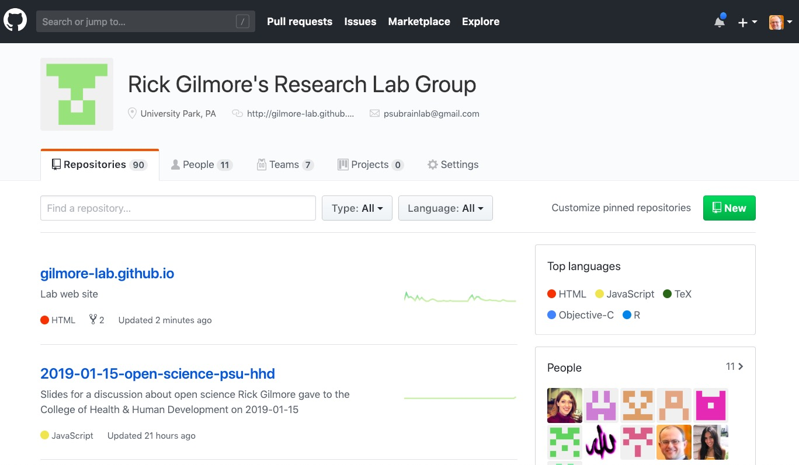
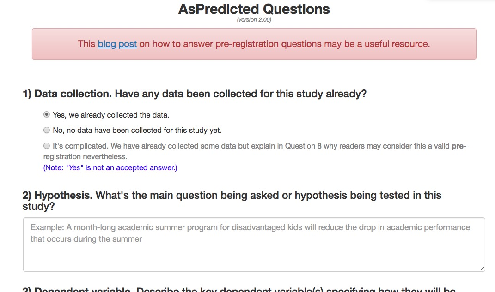

```{r setup, include=FALSE}
knitr::opts_chunk$set(echo = FALSE, warning = FALSE, 
                      message = FALSE,
                      fig.align = "center",
                      out.width = "800px")
```

## Acknowledgements

- Thank you to NICHD, NIMH, NIDA, NIH, NSF, the Alfred P. Sloan Foundation, the James S. McDonnell Foundation, the LEGO Foundation, and the John S. Templeton Foundation

## Agenda

- Prelude
- Some questions to ponder
- Discuss [Errington et al., 2021](http://doi.org/10.7554/eLife.67995)
- Discuss [Munafò et al. 2017](http://www.nature.com/articles/s41562-016-0021)
- Discuss [Silberzahn et al. 2018](https://doi.org/10.1177/2515245917747646)
- Discuss [Gilmore et al. 2018](https://doi.org/10.1177/2515245917746500)

---

- Tools for reproducible science
- An open science future

# Prelude

---

```{r, fig.cap="[Sah et al., 2020](https://doi.org/10.1128/MRA.00169-20)"}

```

```{r}

```

---

<iframe width="560" height="315" src="https://www.youtube.com/embed/66oNv_DJuPc" frameborder="0" allow="accelerometer; autoplay; encrypted-media; gyroscope; picture-in-picture" allowfullscreen></iframe>

<small><https://www.youtube.com/embed/66oNv_DJuPc></small>

# Questions to ponder

## What proportion of findings in the published scientific literature (in the fields you care about) are *actually true*?

---

- 100%
- 90%
- 70%
- 50%
- 30%

## How do we define what "*actually true*" means?

## Is there a reproducibility crisis in science?

---

>- Yes, a significant crisis
>- Yes, a slight crisis
>- No crisis
>- Don't know

<!-- Scrolling final reference page -->
<!-- http://stackoverflow.com/q/38260799 -->
<style>
slides > slide { overflow: scroll; }
slides > slide:not(.nobackground):before {
  background: none;
  }
slides > slide:not(.nobackground):after {
  content: '';
  background: none;
  }
}
</style>
<!-- Scrolling final reference page -->

---

```{r, out.width="750px", fig.cap="[Baker, 2016](http://doi.org/10.1038/533452a)"}
knitr::include_graphics("http://www.nature.com/polopoly_fs/7.36716.1469695923!/image/reproducibility-graphic-online1.jpeg_gen/derivatives/landscape_630/reproducibility-graphic-online1.jpeg")
```

## Have you failed to reproduce an analysis from your lab or someone else's?

---

```{r, fig.cap="[Baker, 2016](http://doi.org/10.1038/533452a)"}
knitr::include_graphics("http://www.nature.com/polopoly_fs/7.36718.1464174471!/image/reproducibility-graphic-online3.jpg_gen/derivatives/landscape_630/reproducibility-graphic-online3.jpg")
```

## Does this surprise you? Why or why not?

## What factors contribute to irreproducible research?

---

```{r, fig.cap="[Baker, 2016](http://doi.org/10.1038/533452a)"}
knitr::include_graphics("http://www.nature.com/polopoly_fs/7.36719.1464174488!/image/reproducibility-graphic-online4.jpg_gen/derivatives/landscape_630/reproducibility-graphic-online4.jpg")
```

## What is reproducibility, anyway?

## *Methods* reproducibility

- Enough details about materials & methods recorded (& reported)
- Same results with same materials & methods

<small>[Goodman et al., 2016](http://doi.org/10.1126/scitranslmed.aaf5027)</small>

---

```{r}
knitr::include_graphics("http://lh6.ggpht.com/_KVa1Tk_k1BU/TTjL-RSY_eI/AAAAAAAABtg/VQIfae1_wtQ/hit_thumb%5B3%5D.jpg?imgmax=800")
```

## *Results* reproducibility

- Same results from independent study

<small>([Goodman et al., 2016](http://doi.org/10.1126/scitranslmed.aaf5027))</small>

## *Inferential* reproducibility

- Same inferences from one or more studies or reanalyses

<small>[Goodman et al., 2016](http://doi.org/10.1126/scitranslmed.aaf5027)</small>

## Is scientific research different from other (flawed) human endeavors?

## Robert Merton

```{r, fig.cap="Wikipedia"}
knitr::include_graphics("https://upload.wikimedia.org/wikipedia/en/0/08/Robert_K_Merton.jpg")
```

---

```{r}
knitr::include_graphics("https://www.klinebooks.com/pictures/28217.jpg?v=1428617395")
```

---

>- **universalism**: scientific validity is independent of sociopolitical status/personal attributes of its participants
>- **communalism**: common ownership of scientific goods (intellectual property)
>- **disinterestedness**: scientific institutions benefit a common scientific enterprise, not specific individuals
>- **organized skepticism**: claims should be exposed to critical scrutiny before being accepted

## Are these norms at-risk?

---

```{r}
knitr::include_graphics("https://www.rd.com/wp-content/uploads/2017/02/01-How-Bad-is-it-to-Share-a-Toothbrush-159311405-ABykov-760x506.jpg")
```

---

> "*...psychologists tend to treat other peoples’ theories like toothbrushes; no self-respecting individual wants to use anyone else’s.*"

<small>[Mischel 2009](https://www.psychologicalscience.org/observer/becoming-a-cumulative-science)</small>

---

> "*The toothbrush culture undermines the building of a genuinely cumulative science, encouraging more parallel play and solo game playing, rather than building on each other’s directly relevant best work.*"

<small>[Mischel, 2009](https://www.psychologicalscience.org/observer/becoming-a-cumulative-science)</small>

# Discussion of Errington et al., 2021

## [Errington et al., 2021](http://doi.org/10.7554/eLife.67995)

> "*We conducted the Reproducibility Project: Cancer Biology to investigate the replicability of preclinical research in cancer biology. The initial aim of the project was to repeat 193 experiments from 53 high-impact papers, using an approach in which the experimental protocols and plans for data analysis had to be peer reviewed and accepted for publication before experimental work could begin. However, the various barriers and challenges we encountered while designing and conducting the experiments meant that we were only able to repeat 50 experiments from 23 papers...*"

---

> "*...First,...the data needed to compute effect sizes and conduct power analyses was publicly accessible for just 4 of 193 experiments. Moreover, despite contacting the authors of the original papers, we were unable to obtain these data for 68% of the experiments...*"

---

> "*Second, none of the 193 experiments were described in sufficient detail in the original paper to enable us to design protocols to repeat the experiments, so we had to seek clarifications from the original authors. While authors were extremely or very helpful for 41% of experiments, they were minimally helpful for 9% of experiments, and not at all helpful (or did not respond to us) for 32% of experiments...*"

---

> "*Third, once experimental work started, 67% of the peer-reviewed protocols required modifications to complete the research and just 41% of those modifications could be implemented.*"

---

> "*...Cumulatively, these three factors limited the number of experiments that could be repeated. This experience draws attention to a basic and fundamental concern about replication – it is hard to assess whether reported findings are credible.*"

# Discussion of Munafò et al., 2017

---

```{r, fig.cap="[Munafò et al. 2017](http://doi.org/10.1038/s41562-016-0021)"}
knitr::include_graphics("https://media.springernature.com/full/springer-static/image/art%3A10.1038%2Fs41562-016-0021/MediaObjects/41562_2016_Article_BFs415620160021_Fig1_HTML.jpg")
```

---

```{r, fig.cap="[Munafò et al. 2017](http://doi.org/10.1038/s41562-016-0021)"}
knitr::include_graphics("img/munafo-table-1.png")
```

## Do these issues affect your research?

## Do the solutions seem reasonable and appropriate? Are you convinced?

# Silberzahn et al., 2018

---

>"*Twenty-nine teams involving 61 analysts used the same data set to address the same research question: whether soccer referees are more likely to give red cards to dark-skin-toned players than to light-skin-toned players.*"

## How much did results vary between different teams using the same data to test the same hypothesis?

---

```{r, fig.cap="[Silberzahn et al. 2018](https://doi.org/10.1177/2515245917747646)"}
knitr::include_graphics("https://journals.sagepub.com/na101/home/literatum/publisher/sage/journals/content/ampa/2018/ampa_1_3/2515245917747646/20181024/images/large/10.1177_2515245917747646-table4.jpeg")
```

## What were the consequences of this variability in analytic approaches?

---

```{r, fig.cap="[Silberzahn et al. 2018](https://doi.org/10.1177/2515245917747646)"}
knitr::include_graphics("https://journals.sagepub.com/na101/home/literatum/publisher/sage/journals/content/ampa/2018/ampa_1_3/2515245917747646/20181024/images/medium/10.1177_2515245917747646-fig2.gif")
```

## Did the analysts’ beliefs regarding the hypothesis change over time?

---

```{r, fig.cap="[Silberzahn et al. 2018](https://doi.org/10.1177/2515245917747646)"}
knitr::include_graphics("https://journals.sagepub.com/na101/home/literatum/publisher/sage/journals/content/ampa/2018/ampa_1_3/2515245917747646/20181024/images/medium/10.1177_2515245917747646-fig4.gif")
```

---

>"*Here, we have demonstrated that as a result of researchers’ choices and assumptions during analysis, variation in estimated effect sizes can emerge even when analyses use the same data. *"

---

>"*These findings suggest that significant variation in the results of analyses of complex data may be difficult to avoid, even by experts with honest intentions.*"

---

>"*The best defense against subjectivity in science is to expose it.*"

---

>"*Transparency in data, methods, and process gives the rest of the community opportunity to see the decisions, question them, offer alternatives, and test these alternatives in further research.*"


## Not just in psychology...{.smaller}

```{r, fig.cap="[Botvinick-Nezer et al. 2020](https://doi.org/10.1038/s41586-020-2314-9)"}
knitr::include_graphics("img/botvinick-nezer-nature-2020.png")
```

## Do related issues affect *your* research?

## How could a 'many analysts' approach be helpful/harmful?

# Practical Solutions

## What to share

- Data
- Analysis code
- [Displays](https://nyu.databrary.org/volume/144), [materials](https://nyu.databrary.org/volume/248)
- [Procedure manuals](https://play-project.org)

## How to share

- With ethics board/IRB approval
- With participant permission

## Where to share data?

- Lab website vs.
- Supplemental information with journal article vs.
- Data repository

---

- [Open Science Framework (OSF)](http://osf.io)
- [ICPSR](https://www.icpsr.umich.edu/icpsrweb/)
- [Databrary](http://databrary.org)
- [OpenNeuro](http://openneuro.org)

## When to share

- Paper goes out for review or is published
    - Some journals in some fields require post-acceptance "verification"
- Grant ends
- ~~Never~~

## How do these suggestions impact your research?
    
# Tools for reproducible science

## What is version control and why use it?

---

```{r, out.width="900px"}
knitr::include_graphics("http://smutch.github.io/VersionControlTutorial/_images/vc-xkcd.jpg")
```

---

- thesis_new.docx
- thesis_new.new.docx
- thesis_new.new.final.docx

vs.

- thesis_2019-01-15v01.docx
- thesis_2019-01-15v02.docx
- thesis_2019-01-16v01.docx

## Version control systems

- Used in large-scale software engineering
- svn, bitbucket, git
- GitHub

## How I use GitHub

- Every project gets a repository
- Work locally, commit (save & increment version), push to GitHub
- Talks, classes, software, analyses, web sites

---

```{r, fig.cap="https://github.com/gilmore-lab"}

```

## FAIR data principles

Data should be...

- **F**indable
- **A**ccessible
- **I**nteroperable
- **R**eusable

[Wilkinson et al. 2016](https://doi.org/10.1038/sdata.2016.18)

---

- Data in interoperable formats (.txt or .csv)
- Scripted, automated = minimize human-dependent steps.
- Well-documented
- Kind to your future (forgetful) self
- Transparent to me & colleagues == transparent to others

## Scripted analyses

- SPSS, SAS, R, Python
- [Jupyter notebooks](https://jupyter.org/)
- [R Markdown](https://rmarkdown.rstudio.com) via RStudio

---

```
# Import/gather data

# Clean data

# Visualize data

# Analyze data

# Report findings
```

---

```
# Import data
my_data <- read.csv("path/2/data_file.csv")

# Clean data
my_data$gender <- tolower(my_data$gender) # make lower case
...
```

---

```
# Import data
source("R/Import_data.R") # source() runs scripts, loads functions

# Clean data
source("R/Clean_data.R")

# Visualize data
source("R/Visualize_data.R")
...
```


## But my SPSS syntax file already does this
    
- Great! How are you sharing these files?
- (And how much would SPSS cost you if you had to buy it yourself?)

## But I prefer {Python, Julia, Ruby, Matlab, ...}

- Great! Let's talk about [R Markdown](https://rmarkdown.rstudio.com/)

## Reproducible research with [R Markdown](https://rmarkdown.rstudio.com/)

- Add-on package to R, developed by the RStudio team
- Combine text, code, images, video, equations into one document
- Render into PDF, MS Word, HTML (web page or site, slides, a blog, or even a book)

---

- [R Markdown documentation](https://rmarkdown.rstudio.com/); online [tutorial](http://r4ds.had.co.nz/r-markdown.html); Mike Frank and Chris Hartgerink's [tutorial](https://libscie.github.io/rmarkdown-workshop/handout.html)
- Similar to Mathematica notebooks, [Jupyter notebooks](http://jupyter.org)

---

```
x <- rnorm(n = 100, mean = 0, sd = 1)
hist(x)
```
---

```{r}
x <- rnorm(n = 100, mean = 0, sd = 1)
hist(x)
```
---

The mean is `r mean(x)`, the range is [`r min(x)`, `r max(x)`].

## Ways to use R Markdown

- Web [pages](http://gilmore-lab.github.io/) | [Rmd](https://raw.githubusercontent.com/gilmore-lab/gilmore-lab.github.io/master/index.Rmd)
- [Talks](https://gilmore-lab.github.io/DEVSEC-2018/promise-of-open-dev-sci/) | [Rmd](https://raw.githubusercontent.com/gilmore-lab/DEVSEC-2018/master/promise-of-open-dev-sci/index.Rmd)
- [Project notes](https://github.com/gilmore-lab/infant-moco-eeg/blob/master/plan-of-work.Rmd)
- Documentation: [HTML](https://gilmore-lab.github.io/databrary-reqmts-specs/databrary_1.0.html) | [Rmd](https://raw.githubusercontent.com/gilmore-lab/databrary-reqmts-specs/master/databrary_1.0.Rmd)

## Ways to use R Markdown

- Scriptable figures: [PDF](https://github.com/PLAY-behaviorome/site-demographics/blob/master/img/ed-attain-bars-plot-1.pdf) | [Rmd](https://raw.githubusercontent.com/PLAY-behaviorome/site-demographics/master/educational_attainment.Rmd)
- Scriptable timelines from Datavyu files: [Example](https://github.com/PLAY-behaviorome/video-coding/blob/master/img/NYU019/time-line-plot-00-60-1.png?raw=true) | [Rmd](https://raw.githubusercontent.com/PLAY-behaviorome/video-coding/master/timeline.Rmd) 
- Papers: [PDF](https://github.com/psu-psychology/r-bootcamp-2018/blob/master/talks/gilmore-hallquist-bootcamp-2018-papaja.pdf) | [Rmd](https://raw.githubusercontent.com/psu-psychology/r-bootcamp-2018/master/talks/gilmore-hallquist-bootcamp-2018-papaja.Rmd)

## Registered reports and pre-registration

---

```{r}
knitr::include_graphics("https://cdn.cos.io/media/images/registered_reports.width-800.png")
```

<https://cos.io/rr/>

## Why preregister?

- Nosek: "Don't fool yourself" ("...and you are the easiest to fool" -- R. Feynmann)
- Separate *confirmatory* from *exploratory* analyses
- Confirmatory (hypothesis-driven): *p*-hacking matters
- Exploratory: *p*-values hard(er) to interpret

## How/where

- OSF: <http://help.osf.io/m/registrations/l/524205-register-your-project>
- [AsPredicted.org](https://aspredicted.org/)

---

```{r}
knitr::include_graphics("img/as-predicted-1.jpg")
```

---

```{r}

```

---

```{r}
knitr::include_graphics("img/as-predicted-3.jpg")
```

---

```{r}
knitr::include_graphics("img/as-predicted-4.jpg")
```

## Skeptics and converts

- Susan Goldin-Meadow (skeptic), ["Why pregistration makes me nervous"](https://www.psychologicalscience.org/observer/why-preregistration-makes-me-nervous)
- Mike Frank (former skeptic, now advocate), ["Pregister everything"](http://babieslearninglanguage.blogspot.com/2016/07/preregister-everything.html)

- Preregistration can constrain the data analysis process, but...

---

>"To investigate whether,in psychology, preregistration lives up to that potential, we focused on all article spublished in Psychological Science with a preregisteredbadge between February 2015 and November 2017, and assessed the adherence to their corresponding preregistration plans. We observed deviations from the plan in all studies, and, more importantly, in all but one study, at least one of these deviations was not fully disclosed."

[Claesen et al., 2019](https://doi.org/10.31234/osf.io/d8wex)

## Large-scale replication studies

## Studies are underpowered {.smaller}

```{r, fig.cap="[Szucs & Ioannides, 2017](http://doi.org/10.1371/journal.pbio.2000797)"}
knitr::include_graphics("http://journals.plos.org/plosbiology/article/file?id=10.1371/journal.pbio.2000797.g003&type=large")
```

---

<div class="centered">
> "*Assuming a realistic range of prior probabilities for null hypotheses, false report probability is likely to exceed 50% for the whole literature.*"

[Szucs & Ioannides, 2017](http://doi.org/10.1371/journal.pbio.2000797)
</div>

## Many Labs

```{r, fig.cap="[Klein et al. 2014](http://econtent.hogrefe.com/doi/abs/10.1027/1864-9335/a000178)"}
knitr::include_graphics("https://econtent.hogrefe.com/na101/home/literatum/publisher/hogrefe/journals/content/zsp/2014/zsp.2014.45.issue-3/1864-9335_a000178/20150727/images/large/zsp_45_3_142_fig1a.jpeg")
```

---

## Reproducibility Project: Psychology (RPP)

> "*...The mean effect size (r) of the replication effects...was half the magnitude of the mean effect size of the original effects...*"

<small>[Open Science Collaboration, 2015](http://science.sciencemag.org/content/349/6251/aac4716)</small>

---

> "*...39% of effects were subjectively rated to have replicated the original result...*"

<small>[Open Science Collaboration, 2015](http://science.sciencemag.org/content/349/6251/aac4716)</small>

---

```{r, fig.cap="[Camerer et al. 2018](https://www.nature.com/articles/s41562-018-0399-z)"}
knitr::include_graphics("https://mfr.osf.io/export?url=https://osf.io/fg4d3/?action=download%26mode=render%26direct%26public_file=True&initialWidth=698&childId=mfrIframe&parentTitle=OSF+%7C+F1+-+EffectSizes.png&parentUrl=https://osf.io/fg4d3/&format=2400x2400.jpeg")
```

<!-- Figure from Camerer et al. 2018 -->

---

```{r, fig.cap="[Camerer et al. 2018](https://www.nature.com/articles/s41562-018-0399-z)"}
knitr::include_graphics("https://mfr.osf.io/export?url=https://osf.io/8pc9x/?action=download%26mode=render%26direct%26public_file=True&initialWidth=698&childId=mfrIframe&parentTitle=OSF+%7C+F4+-+PeerBeliefs.png&parentUrl=https://osf.io/8pc9x/&format=2400x2400.jpeg")
```

## If it's too good to be true, it probably isn't

<https://80000hours.org/psychology-replication-quiz/>

# An open science future...

---

> "*The advancement of detailed and diverse knowledge about the development of the world’s children is essential for improving the health and well-being of humanity...*"

<small>SRCD Task Force on Scientific Integrity and Openness</small>

---

> "*We regard scientific integrity, transparency, and openness as essential for the conduct of research and its application to practice and policy...*"

<small>SRCD Task Force on Scientific Integrity and Openness</small>

---

>"*...the principles of human subject research require an analysis of both risks and benefits...such an analysis suggests that researchers may have a positive duty to share data in order to maximize the contribution that individual participants have made.*"

<small>[Brakewood & Poldack, 2013](http://dx.doi.org/10.1016/j.neuroimage.2013.02.040)</small>

---

```{r}
knitr::include_graphics("http://cdn2.hubspot.net/hub/134568/file-1208368053-jpg/6-blind-men-hans.jpg")
```

<!-- We don't have to be like the blind men and the elephant -->

---

```{r}
knitr::include_graphics("http://static.neatorama.com/images/2012-09/girl-hugging-elephant.jpg")
```

---

<div class="centered">
<video width="800" loop data-autoplay>
  <source src="https://github.com/gilmore-lab/DEVSEC-2018/blob/master/mov/databrary-splash.mp4?raw=true" type="video/mp4">
  </video>

rog1@psu.edu</br>

<https://gilmore-lab.github.io></br>

<https://psu-psychology.github.io/psy-543-clinical-research-methods-2022/>
</div>

---

## Stack

This talk was produced on `r Sys.Date()` in [RStudio](http://rstudio.com) using R Markdown and the ioslides framework.
The code and materials used to generate the slides may be found at <https://psu-psychology.github.io/psy-543-clinical-research-methods-2022/>.
Information about the R Session that produced the code is as follows:

```{r session-info}
sessionInfo()
```
